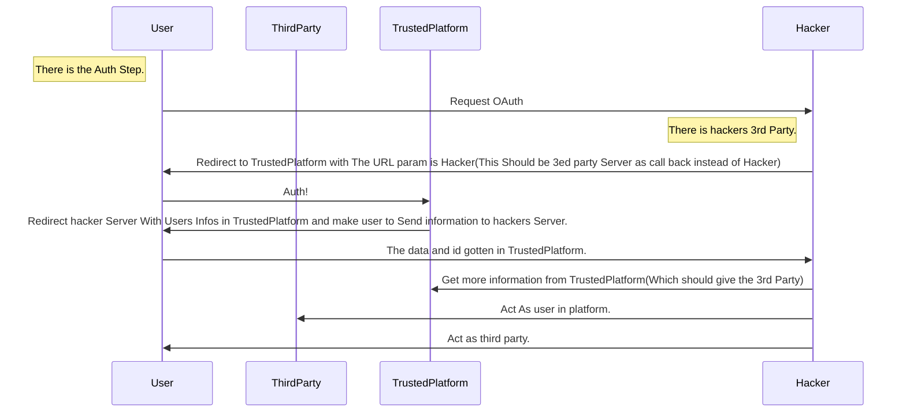

> # Attack Code PART 1 - Intro And Funny Weakness

# What You Need Know - MISC

## Cloud 

什么是 [云计算](https://en.wikipedia.org/wiki/Cloud_computing)?

**通过付费和互联网, 使得共享的软硬件资源和信息可以按需求提供给计算机各种终端和其他设备, 使用某个或者多个服务商提供的电脑基础建设用作于计算和资源.** 这便是我们所看到的 **云**. (Everything as a Service. [EaaS,aaS])

复杂的定义并非我的意愿, 搬弄众说周知的概念脱离主题也显得文章垃圾. 

所以我想我可以这样从一个开发者或是运维者 (DevOps) 的方面去重新定义.

各位大厂牵头, 诸如阿里(aliyun) 华为(huawei cloud) Google(GCP) Amazon(AWS) 为小微企业, 个人用户, 甚至是学生**提供一套几乎覆盖完整开发生命周期的生态性质的产品**. 

在本文中我们侧重于 **开发** 相关内容, 所以下面列出了常见的几个方面:

例如

- 代码 
  - 诸如 代码托管 (这里有 腾讯 Coding 平台) 其他也有各种代替 不过不多见
- 数据存储
  - 对象存储 OSS COS
  - 数据库管理 RDS (Mysql redis 服务即买即用 统一管理)
- 部署
  - 服务器 ECS 这类产品 
  - 中间件
  - 消息队列
  - CDN 缓存 高效的内容分发
  - 安全产品 诸如 DDoS 防护 云防火墙
- 虚拟化
  - 容器编排 比如直接购买的 K8s 集群 (这种基本上都有)
  - 存储虚拟化 虚拟云盘存储
  - 网络虚拟化 SDN 软件定义网络 自定义内网 VPC 域名 IP
  - 容器镜像存储 上传 管理
- 周边的其他服务
  - 计算服务: GPU 服务器 为大数据和人工智能学者研究者 提供服务
  - Serverless: 无服务 计算代理分摊计算压力 不购买服务器 可以节约成本
  - 运维相关: 日志管理 防护 简单运维 域名网站托管 云负载均衡
  - IoT 设备联系
  - 短信服务
  - 云 API 化 可编程化: cli 程式和其背后的 API 服务器

这一套内容, 涵盖了几乎大部分的常见云服务.

## Infrastructure-as-Code(IaC)

基础架构即代码. 起初, 这个诞生于一种开发和运维协同的需求.

因为安全生产和权限控制的需要所以开发人员在实际上很可能是没有服务器 Access 权限的. 那么开发想要确定部署的问题( Debug ), 就会变得尤为困难.

其次, 在最经典的从代码到上线的流程中, 开发者提交的代码往往需要经历 "检查" "Review" "测试" "发版*(集成)" 才能到达部署端. 所以开发其实对线上环境属于是鞭长莫及.

在这个时候, 他们需要共同约定一个文档或者说明, 根据这个指示来进行部署操作. 当然, 真的协作开发过的懂哥都知道, 大多数情况下, 文档是真的没人写没人看. 有时候版本一迭代, 坏了, 部署方式变了. 这里微微留一个伏笔.

于是 IaC 这种应运而生, **通过配置类或者简单脚本类的工具, 定义或者声明一个部署的过程和依赖的资源(依赖库版本, 打包方式, 启动方式, 服务器资源(网络,数据库),日志)**, 就成为了一种沟通的方式. 如果引用了诸如 Git 这种版本控制工具, 那么这种文本类型的配置也享受了版本控制的便利. 当你把 Code 维护在 Git 里, 就成了 GitOps.

当然之后, 配置方法也不需要和运维进行沟通了, 直接面向服务器, 云和 自动集成-自动部署 ( CICD )

## Wrap up

这一切的一切本质目的是 **解决开发相关的其他困难**, 即解决部署的困难(普通开发者不能直接买服务器放家里吧), 维护和配置的困难(要公网 IP 要配网吧), 也是为了让大多数的程序员更专心于业务代码的实现, 忽略其他的不必要的内容. 也使得企业或者组织的分工更为精细化, 权限更为的分散易控. (当然身为企业 还有其他的利弊, 但是这已经超过本文的主题了.)

我看到, 开发的方式和工具, 正在迎来或者正在经历一场新的革命.

# How Attack Vector Included in DEV

## Intro

这里简单的以开发视角进行开发者开发周期作为基础的路线和视角, 简单总结一下, 一个产品或者一个服务脆弱点的引入位置.

## Access Company

### Accessing and Authorization

如果你是一个加入的公司的新的开发人员, 那么一般会直接进入公司, 如果公司在海外或者公司异地, 那么 VPN 这类接入工具, 或者 SwitchHosts 这类 Hosts 修改器 将会被用来和公司服务进行通讯. 

这些是进入公司内网的主要入口. 而且是**合法合规**的员工 VPN 的接入. 这个玩意的价值相当于在铜墙铁壁的城墙上敞开的大城门, 从装作员工混进去是最好的进入公司大内网的办法.

而且你看每年 HVV 的某厂商就 **"被批发" SSLVPN 洞**.

当然还有些具有统一验证的 CAS 啦. 提供 SSO Login. 这些大多数是因公司而异. 提供给员工和外来客户的统一验证鉴权之类的服务. 同时也正因为有混进去的可能, 所以这里通常会严格把手.

### inner or external Publisher

这里说的一般是公司的首页一类的, 其中大部分是静态的资源托管. 

不过有些公司还会有诸如 CMS (dedecms, wordpress) 系统, 甚至是 webplus 站群发布作为对外的资源展示. 

这种一般是网站的大门或者内部消息的发布平台. 对外没什么特殊的, 都是定期有人维护的东西. 对内就不一样了. 如果扫到对外开放可以认认真真看看. 比如 前两年的 b 站 dedecms 暴露.

这些不是很重要. 和主题略远.

## Before Code

### Project management

作为开发人员, 在一个服务处于一种什么都没有的初始情况下, 会收到 诸如入职指南, 业务需求, 设计文档一类的杂项文件. 这些可能是存放在例如 禅道 这种, 项目管理工具的下面, 或者说企业邮箱之类的. 

当一个渗透测试成员还可能以某种方式接触到了对方的项目管理, 清单, 设计和需求文档一类的东西. 基本可以看到一个项目的大概面貌. 这里留下的信息会为渗透测试人员提供更多的相关产品开发测试的机密内容, 包括但不限于 多了几个 BUG 啊 什么 BUG 啊, 有哪些漏洞啊之类的敏感信息. 还有可能会有测试账号什么的(这类也可以直接用来进行线上测试之类的东西). 

我们可以进行一个"中间人" ,监听甚至是伪造相关的信息, 来获得更大的权限和内容.

> 这里额外提及一下 上小章的 SSO 这种统一验证方法在具有"新项目"测试账号情况下, 鉴权 Weakness Point.
> 
> 在测试情况下, 为了避免麻烦, 很多都不需要验证 2FA. 比如手机号短信验证. 这就造成了第一个 Bypass 点
> 在测试账号时, 一般都会有诸如 SVIP/会员 的东西, 而且在具有 SSO 的情况下, 可以成功认证其他的服务, 通过API 对其他服务进行测试和利用. 这种脆弱点, 常常发生在具有开发较为大型程序或者网站的公司中.
> 接着我们可以着眼于文件服务, 共享服务一类的服务进行更多的信息探查和收集. 时常翻看这些内容总能有意想不到的收获.

这些信息对于获取**一个公司的组织架构**, **公司的成员信息**, **高权限用户或者管理员**具有很好的指示性作用和钓鱼价值. 为下一步行动提供一定的方向.

### Office

这里主要想说的是相关 政务系统 OA 财务系统 邮件系统 Exchange 等等办公系统. 这些是企业的高度机密. 这些是可以检查的目标, 采集到的信息往往具有很大利用面. 

 当然只是简答一提. 也和程序员基本没太大关系 和开发也是扯远了.

### Ignorable Access

还有些意外的暴露是也是非常致命的. 包括但不限于易受攻击的内网服务, 匿名 Samba, FTP, git 等. 这些可能是老生常谈了. 这里不说, 下一段再说.

这里想要说的意外的暴露很可能是开发人员或者开发运维人员为图谋省事导致的. 而且很可能伴随诸如 **frp 反代, Nginx 临时配置(或者带有错误的配置)** . 将诸如 API 文档, 设计文档, 监控面板, 乃至是账号密码 AKSK 等等重要的开发相关的内容或者服务暴露在外. 这些暴露或者代理可能是临时的, 也有可能会因为遗忘等原因导致永久的留在了网络上.

这些错误配置, 对于一个具有庞大的网站群来说, 是极其不容易被察觉的. 哪怕是经验丰富的安全部门, 也可能更注重于测试应用向的服务, 而忽略掉这些问题. 看过部分渗透测试报告, 他们常常专注于 SQL 注入这种应用安全性质的安全性问题, 对于配置等并没有提及.

当然在云时代的云防火墙和负载均衡, 在这些方面可以起到一定的防护作用, (对 Hacker 来说就是阻碍嘛), 能够部分的对数据进行过滤和处理. 不过他们依旧不能避免诸如黑客冒充(或者接管)正常管理员的维护操作.

## Code itself

### Code init - framework/template oriented

作为开发人员, 接下来应该是 IDE, 然后创建项目, 初始化版本控制, (引入模版) 并且创建代码仓库.

> IDE 中的脆弱点, 基本不太存在, 但其实也可以通过钓鱼的方法, 类似 破解后植入后门. 但是这种攻击不具有专一性. 或者污染代码管理使用常见的 JETBRAINS 启动脚本利用.

在这里就引入了模版和框架本身的问题. 当然模板和框架本身的目的是用来更加方便的创建其他的项目, 然后运用到业务中的. 

所以相对而言, 只要不是很离谱, 光光一个初始的框架基本不足以引起毁灭性的问题. 其利用也是相当困难的. 如果真的引起了, 只能说恭喜, 咱们安全员又有饭吃了, 这必将是一个威胁大量系统的漏洞.

真正引入漏洞的位置应该是在代码编写的过程中, 开发人员在不经意间, 引入一些 BUG 或者 更为严重的漏洞.比如把 Java Mybatis 的模糊查询时候, 把 `#{key}` 写成 `${key}` 导致的数据库注入这些 (后者允许注入表达式)

这些是很容易开发者在开发的时候意外导致的错误.

> 综上, 反过来思考, 如果我们想要测试一个框架的问题或者漏洞, 我们其实应该在项目开发的早期代码中进行寻找. 前期为了便于开发测试, 不会引入过多的内容, 更多是关注核心业务逻辑. 代码往往并不是非常的严谨. 可测试的点位也不是很多, 但是搭好了一个程序的基本的结构和一部分内容. 测有可测, 也很容易发现框架实现上的问题和 BUG. 开发或许并不是很注意, 但是很容易成为安全人员入手的点.

### Hacking API - weak authorization

现在很多网站的设计采用了类似前后端分离的理念, 前端一个 (Vue/React) 框架直接糊一个 WebApp 后端一个 API 服务. (不分离的 PHP 那种还是越来越少见了, 当然还是有的.)

这其实很容易导致 API 接口的弱鉴权. 这种确实非常常见, 在经验不足的开发人员中这类问题是出奇的多. 我认为其主要原因, 应该是 "因为 API 并不是很好的能被枚举的物品而导致的隐蔽性".

> 这里的弱鉴权是指, 其实是有鉴权但是鉴权逻辑不完善, 比如说 校验了是否为登陆用户, 但是没有对权限做良好分离 (可以导致垂直或者水平越权), 这种垂直越权在管理的接口中可以很容易被发现.

#### API Exposure

> 当然 凡事是有例外的, 比如: 
> - 不完备的前端代码混淆或泄漏 尤其是 Webpack:// sourcemap 导致的 意外泄漏.
> - 对外暴露了 Swagger api document 或者其他可能导致泄漏的 api 文档和 调试工具(被 Hacked YAPI (这种存在 RCE 可能)等). 
> - 被入侵的开发人员之间的通讯工具, 比如 项目管理评论等.
> - 开启了 Debug Mode 导致的接口意外暴露, 这些往往会伴随着更为严重的部分代码泄漏,(这部分代码泄漏可以参考本章节上面一部分.) 比如 Django Debug mode. 
> - 报错提示. (服务器对于有些请求 不存在的时候返回 404 存在的时候 参数不足或者方法不对是 40X 或者 50X 在提示信息中可能存在参数的名称或者类型, 甚至是错误的暴露了栈)

这里说说我的发现.

> 根据上面两点(Debug+报错) 我们可以用上一种特殊的技巧. 我称之为 反向调试
> 某些开启 Debug mode 的 Django 程序, 可以通过控制报错的位置, 定制对应的 payload 使得可以控制 Python 在不同的地方进行报错, 使得 Debug 更多地暴露出运行的代码. 
> 调试是为了确定 Bug 在哪里, 而我们是反过来通过 Bug 来进行源码的暴露.

#### Weakness

常见的操作有: [HACK APIs In 2021](https://labs.detectify.com/2021/08/10/how-to-hack-apis-in-2021/)

说回我们的 API 鉴权. API 因为是公开对外让 Client 进行调用的东西, 而对应的来源并不是很能确定. 常常可能有多种不同的 Client (Client 也可以是 Browser). 确定具体的调用对象难度就非常的高, 通常采用多创建一个 Token 来对本 Server 单独验证. 

> 这里具体的方案应该按照实际情况而定.

很多开发为了方便测试功能或者纯纯觉得没关系无所谓(警惕恶意摆烂) 

很多时候会忽略这里相关的鉴权, 可能是交给 Auth 的(抽象出来的 Server 中间件) 或者干脆不鉴权了.

这里会导致很严重的 未授权访问 + 信息泄露 或者 注入问题 , 当然更为常见的是导致水平越权和垂直越权(通常在 3 个以上的权限级别的情况下就很容易出现这种问题. [RBAC](https://zh.wikipedia.org/zh-tw/%E4%BB%A5%E8%A7%92%E8%89%B2%E7%82%BA%E5%9F%BA%E7%A4%8E%E7%9A%84%E5%AD%98%E5%8F%96%E6%8E%A7%E5%88%B6) 不在讨论范围内.)

脆弱的鉴权还有一个 问题是不正确的验证实现

这里上面 SSO 不算是这种问题 因为设计出来本来就是这样的

在我举一个 OAuth 的例子 在验证的时候 Redirect 没有严格限制 也没有参数

比如允许你任意跳转 这样我们可以写入一个我们自己可控的服务 然后获取到平台的 Token. 
接下来我们可以对用户伪装成第三方服务提供一些服务等 伪装用户从可信任平台获取用户信息 伪装用户请求第三方服务

