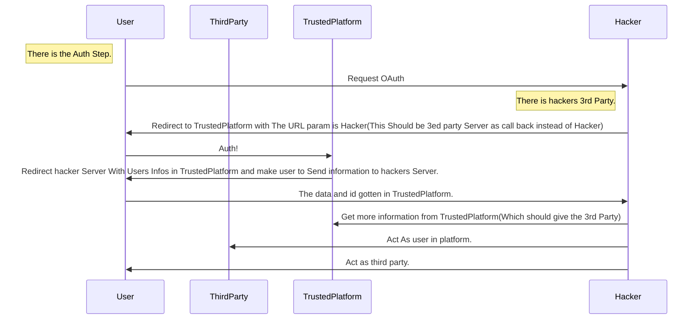

# Intro

This article is more of an(?) introductory article. If you are already familiar with these topics or have prior penetration testing experience, feel free to briefly review the conclusion and content, expand your thinking, have a laugh, and move on.

Of course, if you have any thoughts or want to add something to the text, you can leave a comment below or directly [email me](mailto:cloud-sec-from-blog@eson.ninja).
 PS: Of course, explain your intention. The article does not contain any actual invasive operations or execution commands, mainly sharing the so-called thought process.

This article summarizes some of my **discoveries from penetration testing in my dreams** /LoL.

> Author: Esonhugh
>
> This is the whole Part of "Attack 'Code'"
>
> Intro Cloud Security for you And Show some thing funny i found.
>
> I will try to simplify my expression to increase information density

Thank you for reading.

> **Attack Code PART 1 - Intro And Funny Weakness**

## What You Need Know - MISC

### Cloud

What is [cloud computing](https://en.wikipedia.org/wiki/Cloud_computing)?

**Through paying and the internet, shared software and hardware resources and information can be provided on demand to various end devices and other devices for computing and resources, using the computer infrastructure of one or more service providers as a service. This is the "cloud" we see.** (Everything as a Service. EaaS, XaaS)

Of course, I don't intend to use complex definitions that are irrelevant to the topic. So I think I can redefine this from the perspective of a developer or DevOps:

Leading companies like Alibaba (Aliyun), Huawei (Huawei Cloud), Google (GCP), and Amazon (AWS) **provide a suite of products that cover almost the entire development lifecycle for small and micro enterprises, individual users, and even students.**

In this article, we focus more on **development**-related content, so the following aspects are commonly listed:

For example:

- Code
  - Code hosting services like Tencent Coding Platform and various alternatives (not very common though)
- Data storage
  - Object storage like OSS  AWS S3
  - Database management like RDS (turnkey Mysql, Redis services for unified management)
- Deployment
  - Virtual Server products like ECS (in AlibabaCloud) EC2 (in AWS)
  - Middleware or Gateways
  - Message queues
  - CDN caching for efficient content delivery
  - Security products like DDoS protection and cloud firewalls
- More Virtualization 
  - Container orchestration like ready-to-use Kubernetes clusters (almost all have this)
  - Storage virtualization like virtual cloud disks
  - Network virtualization like SDN for customizable internal networks, VPCs, domain names, IPs
  - Container image storage for uploading and managing images
- Other peripheral services
  - Compute services: GPU servers for big data and AI researchers
  - Serverless: Proxy compute to distribute workload without buying servers to save costs
  - Ops-related: Log management, protection, simple ops, domain and website hosting, cloud load balancing
  - IoT device connectivity
  - SMS services
  - Cloud APIs for programmability: CLIs and underlying server APIs

This suite covers most common cloud services in developers and hackers' eyes.

## Infrastructure-as-Code (IaC)

Infrastructure as code maybe originated from the need for collaboration between development and operations.

Due to security and access control requirements, developers often do not have direct server access privileges in practice. This makes debugging deployment issues extremely difficult for developers.

Additionally, in the classic workflow from code to deployment, code submitted by developers often has to go through "inspection", "review", "testing", and "release" before reaching the deployment side. So developers don't really have access to production environments.

At this point, they need to agree on some documentation or instructions to guide the deployment process. Of course, as those who have done collaborative development know, most of the time no one writes or reads the docs. Sometimes when a version iterates, things break and the deployment method changes. This foreshadows something I'll mention later.

So IaC emerged to **define or declare the deployment process and resource dependencies (dependency library versions, packaging methods, startup methods, server resources like networking and databases, logging) through configuration scripts/tools.** Using version control tools like Git brings scripted infrastructure definitions under version control. When you maintain the code in Git, it becomes GitOps. So It converts abstract infrastructure as a kind of code snippets.

Now, instead of coordinating with ops, config definitions allow developers who are also responsible for ops in DevOps to directly interface with servers, cloud, and CI/CD for business needs and requirements. Eliminating coordination overhead improves efficiency and speed.

## Wrap up

It's important to note the core purpose is to **solve other difficulties related to development**, namely deployment difficulties (regular developers can't buy servers and put them at home), maintenance and configuration difficulties (need public IPs and networking configured), and to allow most programmers to focus more on business code implementation while ignoring unnecessary complexity. It also enables more granular division of labor and access control for organizations and companies. (Of course there are also pros and cons for enterprises, but that exceeds the scope of this article.)

I see that the tools and methods of development are undergoing a new revolution.

# How Attack Vectors Are Introduced in DEV

## Intro

Here I briefly summarize the entry points for vulnerabilities from the perspective of a developer's workflow.

## Access Company

### Accessing and Authorization

If you are a new developer joining a company, you will normally directly access the internal network (physically), but if the company is overseas or remote, some effort is required. This is where remote access tools like VPN (accessing cloud internal networks/VLANs) or SwitchHosts (Hosts file modification tools for DNS resolution) come in.

So these are the main entry points for **internal personnel** to access the company's internal network. And it is **legitimate employee** VPN access. This is like a huge open city gate in a walled fortress, so impersonating an employee to get inside the large internal network is the best way. I doubt anyone wants to break through extremely thick walls to invade right?

And as we see, major VPN products get "wholesale" vulnerabilities **every year** at a certain event. (In China. Ah you know. I can't describe more.)

Of course, there is some security (verification measures) and some have unified authentication like CAS. Most provide SSO Login and may have other solutions. But these policies tend to vary by company. They provide unified authentication and authorization services for employees and external customers. Since infiltration is possible, security is usually strict here. They just like a Gate with a lot of security guards.

### Inner or External Publisher

This generally refers to homepage-like content of the company, mostly static hosted resources.

Some companies also have some internal CMS systems (dedecms, wordpress) or webplus site cluster publishing systems for external resource display.

These are typically used as public-facing platforms or internal messaging platforms. Nothing too special for external purposes, usually maintained regularly. 

Internal exposure is different. If its external access is allowed, it's worth a close look for hackers. Sensitive info leakage and an initial foothold may be available, just like Bilibili's dedecms issue from a few years ago.

But these often involve some specific business logic in specific company, not too important for this article or topic. We should put on something 

### Easily-Ignored Access

Of course, accidental service exposure can also be extremely deadly. This includes but is not limited to: vulnerable internal network services, anonymous Samba, FTP, Git, etc. But these are all old news. More on this later.

Here I want to point out that accidental exposure can easily be caused by developers or DevOps wanting to cut corners. And it may involve things like **developer self used reverse proxies(FRP NPS), temporary Nginx configs (or misconfigured ones) even a NodePort in Kubernetes.**. Key development-related content or services like API docs, design docs, monitoring dashboards, and even important creds like account passwords and access keys may be improperly exposed externally. The exposure or proxying could be temporary, but could also persist indefinitely online due to developer/maintainer negligence and oversight. So that some big company make such kind of issue as a security red line.

These subtle misconfigurations (Some service like SMB has different ports and protocols, This kind of http based content is less likely to be checked.), can be extremely difficult to detect given the massive scale of some sites and services. Even experienced security teams may focus more on testing application-layer services while overlooking these issues.

I've had the privilege of seeing some penetration testing reports where business units focused heavily on application security issues like SQL injection vulnerabilities and did not mention configuration, etc.

> maybe the developing itself is so tricky for them.

Of course, in the cloud era, cloud firewalls and load balancers can provide some protection (obstacles for hackers) by filtering and processing data. 

> But they still cannot prevent attackers from impersonating normal admin(or developer itself) maintenance operations. You can't deny your owner's order, right? So there is another part.
## Code Itself

### Code Init - Framework/Template Oriented

So now Back to the context.

As a developer, the next steps are usually to launch an IDE, initialize version control, import templates, create a code repository or clone other people's code and prepare the environment on your own computer.

> IDE vulnerabilities basically don't exist, but can be compromised through phishing to inject backdoors. But that's not a targeted attack. Potentially tampering with code management and injecting common startup scripts from JETBRAINS or VSCode could work.
> 
> Developer tools with config is need to take notes. By poisoning some configuration files or break down the tools itself, They could have higher privilege to execute commands. So if you are a hacker, notes this. 

This brings us to potential issues with templates and frameworks themselves. Of course, frameworks and templates aim to facilitate creating other projects that then get applied to business use cases.

So barring any extremely poor practices, a basic initialized framework is unlikely to cause disastrous problems on its own. Attempted exploitation is also quite difficult. Truly damaging vulnerabilities reflect poorly on security staff for missing threats to many systems.

> When writing this section, I was thinking about M3i Merz1's Spring framework vulns.

The real vulnerabilities are introduced during code development when developers inadvertently introduce bugs or more seriously, security flaws. For example, using `${key}` instead of `#{key}` in fuzzy Java Mybatis queries leads to database injection (the former allows injection OGNL expressions).

These kinds of mistakes are easy to accidentally introduce during development.

> Looking at this conversely, if we want to test potential framework issues or vulnerabilities, we should look in early project code. Few extra safeguards are added early on when focusing on core business logic implementation. Security hardening efforts are often not rigorous initially. But there are limited testable surface areas. Once basic program structure and some features are implemented, more potential bugs and flaws in framework implementation can be discovered and may be overlooked by developers. These reachable spots are ripe for security researcher exploitation.
>
> This is where my CVE came from.

### Hacking API - Weak Authorization

Many modern website designs adopt concepts like front-end/back-end separation, with a front-end framework directly generating a web app and back-end API services. (Monolithic PHP is becoming less common, but still exists.)

This can easily lead to weak API authentication. This is extremely common among inexperienced developers. I think the main reason is the "hidden" nature of APIs that aren't easily enumerable.

> Here, weak authentication means authentication logic exists but is flawed, for example only checking if the user is logged in without proper permissions separation (can lead to vertical or horizontal privilege escalation). Vertical escalation in admin interfaces can be easily discovered.

#### API Exposure

> Of course there are exceptions, such as:
>
> - Incomplete front-end code obfuscation/leakage, especially Webpack sourcemaps leading to accidental leakage.
> - Exposed Swagger docs or other API docs/debugging tools (hacked YAPI instances with RCE potential).
> - Compromised developer communications like project management comments.
> - Accidental exposure due to enabled Debug Mode, often accompanied by more serious partial code leakage. Django Debug mode enables this.
> - Error messages. (404 for non-existent resources, 40X/50X for incorrect params/methods may reveal param names, types, or even stack traces).

Here I'll share an interesting technique I discovered:

> Based on the above two points (Debug + Error messages), we can use a special technique I term "reverse debugging". Some Django programs with Debug Mode enabled can have Python throw errors in different locations by controlling the payload to trigger errors. This exposes more runtime code through Debug mode. Normal debugging locates bugs, while we reverse this to expose source code using bugs/errors.
#### Weaknesses

Common attacks include: [HACK APIs In 2021](https://labs.detectify.com/2021/08/10/how-to-hack-apis-in-2021/)

Returning to API authentication, APIs are public interfaces for clients to call, so identifying specific callers is extremely difficult. Multiple client types (browsers can be clients too) often exist. Generating unique tokens is commonly used to authenticate servers.

> Specific solutions should fit the use case.

Many developers disable authentication for testing or simply don't care, thinking there's no harm (malicious laziness).

This often leads to serious unauthorized access and information leakage or injection issues. More commonly, it results in horizontal and vertical privilege escalation (very easy with 3+ permission levels).

[RBAC](https://en.wikipedia.org/wiki/Role-based_access_control) is outside this article's scope.

Weak authentication can also stem from incorrect validation implementations.

The SSO example doesn't fall under this - it's designed that way.

As an example, OAuth implementations may allow arbitrary redirect URIs without strict parameter validation.

This allows us to inject our own controllable callback service and obtain platform tokens, then impersonate users to spoofed third-party services to gather user info, and finally impersonate users to request data from real third-party services.

> This can have devastating effects, especially for mandatory "check-in" services.

>  **Attack Code PART 2 - Common Develop Service**

## Codebase

I divide the CodeBase into two categories here: one is version control like Git, which is common and basically exists everywhere. The second is the package library. Some companies have similar package management centers like Maven for more strict control and unified management of the code written and dependencies.
### Version Control Platform

When you finish writing the code and commit it, the code will be stored in version control software like GIT SVN or code hosting platforms.

This is also a place where penetration testers can carefully search for vulnerabilities or sensitive areas.

Common ones are private projects on public platforms like Github, or self-built Gitlab (GItea, etc.), or even cloud vendors' one-stop Devops platforms' Code Space.

> Here I'll briefly mention Tencent Cloud's Coding platform.
>
> It is part of Tencent Cloud's one-stop Devops platform and is also its code hosting platform. It's at e.coding.net.

This is the most core part of an enterprise's code assets. The utilization and vulnerabilities of these things are countless, especially GITLAB. Therefore, modern enterprises often build such code hosting internally. And the correct security policy should be to prohibit external access and add strong verification and strong access control, and pay attention to security issues and provide patches in time. For example, 2FA.

For code auditing itself, hardcoded, mature configuration files, etc., these are the most basic attack surfaces. I won't repeat them here.

Git will also contain a lot of commentary or documentation information. (Many developers do that) The exposure of this additional information also needs to be checked. For example, some IPs have database assets, which are test environments, which are development environments, and some maintenance information may be left in Gitlab snippets and WIKIs. (Of course most cases will not use them)

Similarly, the history in Git log reveals developer personal information to the attacker. It may lead to further utilization in social engineering phishing and so on.

In addition, taking control of the code control platform and auditing and debugging their code is often one of the things security personnel like to do. This means that if more places use this code (or components), security personnel may reuse these vulnerabilities to take down more targets, get more code, and form a positive feedback loop.

### Package Library

Relatively large companies often have their own package management tools. I saw reports before that they could be poisoned. But I don't really understand how to Do Some Evil here. (Lack of imagination)

And I've only encountered it once. At that time I encountered a JAVA MAVEN private service, similar to Nexus and the like. And many vendors are still using Java at this point. Maybe it's common?

> I don't understand Java

## CICD

CICD is also considered a common key target.

> Why?
>
> Because it can execute shell code or scripts, and the permissions required to run normally are still not small. At least it's a root that can run commands. Or a root with cluster creation and modification permissions.

Once you understand this point, then the specific situation is just abusing it. The main abuse focuses on its automatic build and automatic deployment, **modifying its workflow scripts or script consoles** to execute commands/code. And then reuse the returned information.

Therefore, holes in these things are generally not lacking. The big guys are aiming for them. Just look at how diligent Jenkins updates, and you'll understand.

> The most outrageous thing is that I installed a Jenkins only half a day ago, and it was a DDOS hole update.

### Jenkins

Jenkins is already an industry standard. Basically when it comes to CICD it's Jenkins. So much so that in the basic information gathering stage, domain names starting with jenkins can basically be scanned out.

Jenkins-related abuse is so much that you can check out [Hacktricks - Jenkins](https://book.hacktricks.xyz/cloud-security/jenkins) from enumerating information abuse to specific vulnerabilities. This doc is really well written.

> It's just that Jenkins is not really lightweight. Java always has the Java style.

Of course now there are more viable options like Webhook (the Go one), which I think is still good. And some of my systems are using it too. So far it doesn't seem to have many issues. Lightweight but not many features, often need to write Shell.

### Drone

Something newer is Drone CI. A CICD featuring containers, in addition to scripts and the like, is often accompanied by a lot of Kubernetes and docker combined utilization. This part will continue in the next section.

## Multi Environment Failure

Most important part of cluster service, cloud service is service discovery and service bundle. For example, Normal web application + mysql + redis. 

The bundle in Cloud Native could be used as a single micro-service that serves to customers with some single function or program. 

In developer's eyes, Service discovery and service registering in Cluster or other cloud environment make the service bundled as one unit more easily.

But cloud make hacker to exploit more easily. If we can know how the function works, what dependencies it used and where is it. Enumerate other service, discover service nearby by abusing cloud creds and platform apis is as connivance as developer itself. 

Also service union or combination makes exploitable possibility higher. Some service itself could be safe. But some apis logic between services are conflict or vulnerable. 

> example: 
> 
> 1. using CVE-2018-1002105. exploit trust between API service and Kubelet apis. Only API service or kubelet is not vulnerable at all. But both of them is vulnerable.
> 2. Some weave scope is safe and limited external access. But when some service has Pod PortForwarding privs (may be for debug). It makes everything worse.
## Online Testing

Testing is also an important part of the development process. Debugging on cloud service is more difficult. Some developers focus more on Testing.

And in order to be more similar to the real environment, there are usually publicly accessible online testing websites. There are usually words like test in the domain name. I want to divide this part into two sections: `Code Audit Testing` and `Online Testing Clusters`. Mainly the second part Online Testing (Clusters)
### Code Audit

I haven't really encountered this kind of service. I've only seen Sonatype installed in the system once, and running as an automated testing service in the CICD, seeming to do static code checking and testing. (No in-depth research here, leaving a pit first.)

Looking at the introduction and demo, it says it can ensure a certain code security and quality. Some vendors use this to ensure code reliability.

Of course this thing can also execute commands (code). https://help.sonatype.com/repomanager3/integrations/rest-and-integration-api/script-api Even the official docs can see Unsafe at the beginning. 

> But basically there are few code static detection. At most a scan and a code formatting lint or something

> Something interesting is the documents are hacker read-only, lots of developers ignore the official documents and turn to Stackoverflow. (lol)

### Online Testing (Clusters)

> Of course I know many developments debugging with online production env :-).
>
> Such as "me"

Online testing is a point that can be easily overlooked during development, but is a point that security personnel can pay attention to. When a team is going to release a few versions before the official launch (or from the beginning), testing is usually done on a server or additional k8s cluster that is similar to the production environment.

For developers, the online test environment provides a virtual environment similar to the production environment, mainly for pre-launch Debug, finding and eliminating Bugs before they affect the production environment, having more realistic data, and getting the gap between test and expected results. effect, help developers do a better job of development.

> Just like rehearsal of the show.

Among them, resources, configurations, monitoring, etc. are basically the same or even the same as the official service, but the passwords are often weak passwords. At the same time, because it is not the production environment, debugging information is often more, more common and more frequent.

> For example, the frontend will turn on Webpack's SourceMap, and auxiliary console output is common.

It is because of the exposure of these contents that the development test environment is often full of loopholes and higher risk. Protection is often severely lacking. For example, the test environment is not within the protection of security products such as firewalls and WAFs. They may not even have the possibility of having such security products in the first place (of course this is very rare for companies now, so bypassing WAF is also a must for security personnel) .

In addition, some of the test content in the test environment may partially flow into the formal production environment, of course only possibly. Just like the previous SSO Login and test account issues I mentioned that caused full authorization in the formal environment.

> In the cloud this risk will be higher, but cloud stuff in the next section. Leave a foreshadowing here first.

Through these vulnerabilities or simple weak passwords, we can kick in the door of the other party's test environment and collect information. We can easily collect some of their preferences. Although this is not sensitive information in the production environment, discerning red team members can smell the scent in it. For example: the technology stack they like, the weak passwords or password habits they like (like do they prefer 123456 or 111111 or 888888 or prefer other things), test environment configuration/monitoring, etc. Passwords and the like may change, but password preferences won't change quickly. (Some people just like Chinese name PinYin + numbers (birthday or 123456) combinations). Reusing these collected things and reusing them in formal services or other company services will always bring you unexpected gains.

I used to feel bad about hacking the other test environment, but after careful searching, the problems exposed by the test environment are often more and more sensitive.

In the test environment, we want to move laterally more to production and internal, so we need to pay more attention to "sharing data" like public service information in the configuration (such as public databases, public configuration centers, AKSK), permission situations (whether there is transboundary access, etc.) and API documentation (which is difficult to change once finalized), mainly this kind of information that can be reused in other services. After all, the test environment itself is not of much value to the red team.

## Configs/Creds

### Config Server

#### Cross Service

Some companies often have a Config Server service that accesses and distinguishes the credential information and content each service needs through a Creds, which can provide the resources the service needs. Even some external data source or API service.

If configured properly, the exposed content is generally not conducive to further lateral movement. This breakthrough point is generally to look for data between businesses. It is often possible to skip over them. These places are easy to obtain high privileges due to laziness. 

For example, services that share database accounts, **share some resource credentials and API call KEYs**. This kind of service crossover is often simpler and more effective.

#### Man In the Middle

In addition, such configuration services need to prevent man-in-the-middle attacks. Configuration information is generally more sensitive content. Pay attention here.

For example, some services communicate configuration content via HTTP interaction without TLS encryption. Here you just need a Wireshark to capture the content and results of their interaction. How to communicate and how to obtain configuration, everything is clear. This did happen.

e.g. Got the binary file of the other party's service, but no Config of the other party's service. The other party enabled Config Server, but it was plaintext interaction. Here we can directly start the binary + local packet capture, no need to reverse at all.

### Creds

Some are related people's credentials, and it's the **joyous account takeover fraud** again.

For example, getting an employee's account or a system service account can maintain a considerable length of silent monitoring. Especially system-level accounts. For example, the account and password of XXXSYSTEM in other systems (such as email).

> There's no big deal (account theft or forced), otherwise they really won't change their password. You won't either ;-)

Here you can monitor, phish, and do a lot of things. There is also some content and data that has permission to obtain.

For service-type account takeover, such as System or admin, it can be analogized as a Silver Ticket attack in the domain. Taking over system service accounts in the system will be more confusing and covert, so it is very suitable as a backdoor to persist in the corresponding system.

# Attack Coder

> I was originally planning to delete this section. But yesterday I discovered a certain database leak and a slightly related CSDN article that really left me speechless.

In this section I want to explore a possibility - that is, by obtaining employee accounts through social engineering or other means, monitoring their code social sites (CSDN, Juejin some Chinese Social media for programmers and coders) or public code hosting (Github, Gitlab), whether there is a possibility to indirectly reveal the internal technical stack and technical implementation of the corresponding company, or even account and password leaks and APIKey leaks, through employees' submission content and posts on social sites.

Mishandling data can easily lead to such accidents. After some programmers study new technologies or tools, they want to use some examples in the article for illustration, which will involve pasting some code. Desensitization of the code can easily lead to leaks due to these contents. (Like that article)

There are related exploitation and checking tools for such leaks.

But I still think the feasibility of this approach is very low, because leaks may not necessarily be found, not all keys can be used, it is also possible that the programmer's security awareness is very high or does not have an account on such platforms at all. Of course platforms like Github also have leak detection and leak warning emails. For various reasons, if you rely on this, it is very likely to end up fruitless. This is also why I planned to delete the content in this area before.

> **Attack Code PART 3 - Cloud Involved in Codes**
# When Cloud involved

How will our previous attack points change when cloud technology becomes popular as a new technology stack?

> In fact, related content has been mentioned in previous articles.
>
> Let's review the previous parts. I mentioned it in the intro section at the very beginning.
>
> Take a look at CNCF's technology vision https://landscape.cncf.io/
>
>  These software or service projects are all stared at by the experts.

New technologies always bring new gameplays, but at the same time, new attack surfaces. This is the downside of development.

## Container

Containerization is the first technological change in the cloud era.

> To be more precise, containerization and container orchestration brought about the beginning of the cloud era.
>
>  The more common one is Kubernetes, which is Google rewriting its internal orchestration system and then donating it to the Linux Foundation as the beginning of the cloud era.
>
> Of course this is not an article to study history.

Containers mainly provide developers with isolated minimal runtime environments to solve the pain point of "it runs locally but doesn't run remotely". See the IaC section of my first article.

Containers isolate many things. The specific method is to isolate various system resources through some new kernel features like cgroup and namespace, which greatly reduces the harm of traditional attacks that abuse dependent resources.

> For example:
>
>  Consider this scenario: The application and compromised database resources are separated on a container-based repository
>
>  This prevents us from gaining server shell through writing one-line trojans using methods like dumpfile or logs, even if we take over all permissions in the database. The filesystem is isolated here.

However, the container itself still has two core attack surfaces. Here are some escapes, as follows:

\- Kernel shared calls/memory

\- Resources without proper separation, such as proc, etc.

\> I know the interview question Zhiyou gave me [Release-Agent Docker Escape](https://github.com/Esonhugh/Docker-Release-Agent-Escape). It's open sourced now, I built a knowledge graph with Obsidian. Check it out as a reference. Of course this article is also edited here.

The latter is basically an error configuration caused by developers being lazy or careless. The commonly used technique is called LoLBins. This is a very broad topic. I won't go into too much detail here.

\> (To give a small example, the find command with incorrect suid can be used for privilege escalation with `-exec /bin/bash -p` etc.)

## Kubernetes

Google's famous orchestration system developed in Go and then donated to the Linux Foundation, thus CNCF. We won't say too much about the courtesy.

Similar systems include docker swarm, etc. but they are rarely used, and some are commercial solutions.

A "relatively" common configuration in small Internet companies is one set of k8s for development and testing, and one set of k8s environment for formal environment, mutually isolated. But they are very similar, doing microservices internally, and doing an nginx ingress load balancing and API Gateway externally, etc. Coupled with k8s service discovery and other features, it can greatly ensure a similar environment to development and testing during the release process.

> Now there are also many public cloud services that have such services that can be purchased and used out of the box. Although there is no difference from building it yourself (x
>
>  As these services continue to improve, some companies will also gradually use the cloud to build their services.

If you're new to k8s, I'd recommend trying two materials - reading the official docs and [hacktricks cloud security pentesting k8s](https://book.hacktricks.xyz/cloud-security/pentesting-kubernetes) (using the basics there as reading material can also allow us to quickly grasp the key points of the entire k8s framework), especially the latter.

The main vulnerabilities of k8s need to pay attention to the following scenarios

\- The container issues mentioned above

\- Permission configuration issues like serviceaccount credentials

\- Also pay attention to whether there are some serious CVEs, especially privilege escalation ones

\- Exposed control ports, monitoring platforms, management platforms, or Pods with special privileges

In addition, there is a useful enumeration tool called CDK, which also has https://madhuakula.com/kubernetes-goat/docs/ for these common scenarios.

The cluster monitoring web interface is often used by developers to monitor and test the status of the entire cluster. For example weave, of course this is a management tool, and also a **legitimate** backdoor. And it seems someone has done that.

> As we all know, all **management tools** can be abused as **hacker tools**, such as psexec in the sysinternals toolkit.

## Clouds Services

This mainly refers to some public cloud services and some private clouds that can be accessed (government).

Government involves some data of citizens and organizations, such as transportation cards, disease control, epidemic prevention and control, party building, team building, etc. related to people's livelihood services, which are then corresponded or outsourced for use by related systems (such as schools, some organizational departments), etc. This kind of thing is generally done by regional big data companies and cloud service providers.

The core of the cloud is not quite the same as the internal network topics common in CTF, but after getting in touch, I found it somewhat similar to domains.

### Creds Abuse

For example, the cloud focuses on the abuse of high-privilege accounts like AKSK STS and other **credentials**, especially some cross-service credentials. These credentials enrich the resources developers can invoke within the system or cloud, while also helping red teams and penetration testers expand their gains for more and more sensitive information. OSS and other services will have access control policies, etc., very similar to domain object ACLs.

Therefore, during the cloud penetration testing process, we will often focus more on the assets mentioned above, especially credentials. Try to find them and abuse them, combined with some tricks of the internal network, to achieve our goals.

Of course, for developers, programs accessing and using cloud services through SDKs and access credentials provided by cloud service providers can easily develop or manage resources in the cloud. Similarly, because of the cross-service characteristics, the service credentials used in them often become the places where attackers abuse them.

### Metadata

In addition, it is worth mentioning that attention should also be paid to some metadata in the internal network of the cloud environment, also known as the meta-data service. Similarly, this can leak a lot of valuable information, such as secrets, keys, and [quite fatal] STSTokens. This directly leads to SSRF which can directly obtain access to certain resources (OSS ECS) and thus forms a unique exploitation of vulnerabilities like SSRF in the cloud. So much so that many articles now mention this attack method when referring to cloud security.

\> However, not all servers have this information. These often require special configuration.

### Document

Since the cloud is usually a toB business (student personal website hosting and other educational learning services are not really toB, and the volume is not that large either), there will usually be related documents if there is integration, including some API calling methods, SDKs, credential policies, security policies, and even default account passwords. If you are not very familiar with the policies of this cloud, it is highly recommended to consume related documents (not just public clouds, related private clouds and data providers will basically have these). If not, try to scrape the SDK (most likely Java).

## WrapUp

These have been summarized and output in articles and a large number of tools by experts, and even a knowledge matrix similar to ATT&CK.

Such as [T-Wiki](https://wiki.teamssix.com/) [cf](https://github.com/teamssix/cf) aws and [pacu](https://github.com/RhinoSecurityLabs/pacu). Overseas there are no tools for exploiting services of domestic cloud service providers. Basically what you can see on the market are tools developed specifically by Chinese.

# Future

I think the cloud will soon be linked with virtual internal networks and some enterprise internal networks through specific routing methods or network definitions, partially merged, interconnected, resource sharing, and internal network construction.

>  Such situations may be encountered in some special scenarios, such as when some sensitive information cannot be placed on cloud servers and cloud databases but business systems still need to use them, etc.

These may be self-developed systems and virtual networking, or something like AzureAD in the cloud. Of course not just business, but also collaboration with more OA projects, organizational management software, development, service provision, etc.

Looking forward to it.