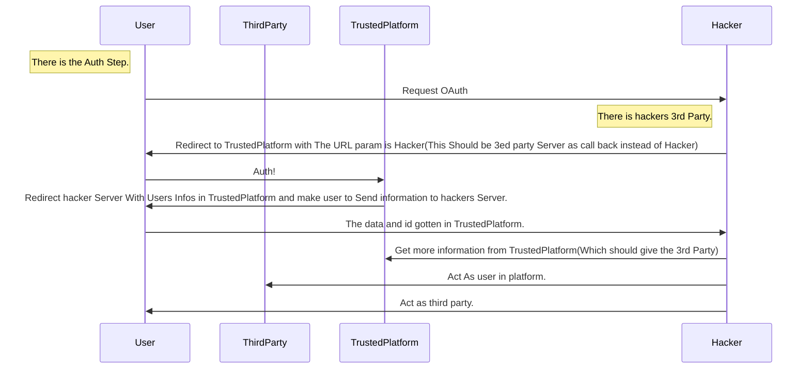

# Intro

这篇文章算是(?)纯纯的引入性质文章, 如果您是熟悉这些的人, 或是有过入侵经验的大懂懂, 可以简单的看看结论和内容, 开拓一下思维, 一笑而过, 当个笑话. 

当然, 如果有对文本有些看法或者有些想要补充的, 可以直接写在下面的评论区, 也可以直接 [mail 我](mailto:cloud-sec-from-blog@eson.ninja). 
PS: 当然记得说明来意. 文章不会有具体的入侵操作的实际内容与执行的命令, 主要是分享所谓的思路.

本文综合了我 **几次在梦里渗透测试时候的发现** /doge

> Author: Esonhugh
> 
> This is the whole Part of "Attack 'Code'"
> 
> Intro Cloud Security for you And Show some thing funny i found.

> # Attack Code PART 1 - Intro And Funny Weakness

# What You Need Know - MISC

## Cloud 

什么是 [云计算](https://en.wikipedia.org/wiki/Cloud_computing)?

**通过付费和互联网, 使得共享的软硬件资源和信息可以按需求提供给计算机各种终端和其他设备, 使用某个或者多个服务商提供的电脑基础建设用作于计算和资源.** 这便是我们所看到的 **云**. (Everything as a Service. [EaaS,aaS])

复杂的定义并非我的意愿, 搬弄众说周知的概念脱离主题也显得文章垃圾. 

所以我想我可以这样从一个开发者或是运维者 (DevOps) 的方面去重新定义.

各位大厂牵头, 诸如阿里(aliyun) 华为(huawei cloud) Google(GCP) Amazon(AWS) 为小微企业, 个人用户, 甚至是学生**提供一套几乎覆盖完整开发生命周期的生态性质的产品**. 

在本文中我们侧重于 **开发** 相关内容, 所以下面列出了常见的几个方面:

例如

- 代码 
  - 诸如 代码托管 (这里有 腾讯 Coding 平台) 其他也有各种代替 不过不多见
- 数据存储
  - 对象存储 OSS COS
  - 数据库管理 RDS (Mysql redis 服务即买即用 统一管理)
- 部署
  - 服务器 ECS 这类产品 
  - 中间件
  - 消息队列
  - CDN 缓存 高效的内容分发
  - 安全产品 诸如 DDoS 防护 云防火墙
- 虚拟化
  - 容器编排 比如直接购买的 K8s 集群 (这种基本上都有)
  - 存储虚拟化 虚拟云盘存储
  - 网络虚拟化 SDN 软件定义网络 自定义内网 VPC 域名 IP
  - 容器镜像存储 上传 管理
- 周边的其他服务
  - 计算服务: GPU 服务器 为大数据和人工智能学者研究者 提供服务
  - Serverless: 无服务 计算代理分摊计算压力 不购买服务器 可以节约成本
  - 运维相关: 日志管理 防护 简单运维 域名网站托管 云负载均衡
  - IoT 设备联系
  - 短信服务
  - 云 API 化 可编程化: cli 程式和其背后的 API 服务器

这一套内容, 涵盖了几乎大部分的常见云服务.

## Infrastructure-as-Code(IaC)

基础架构即代码. 起初, 这个诞生于一种开发和运维协同的需求.

因为安全生产和权限控制的需要所以开发人员在实际上很可能是没有服务器 Access 权限的. 那么开发想要确定部署的问题( Debug ), 就会变得尤为困难.

其次, 在最经典的从代码到上线的流程中, 开发者提交的代码往往需要经历 "检查" "Review" "测试" "发版*(集成)" 才能到达部署端. 所以开发其实对线上环境属于是鞭长莫及.

在这个时候, 他们需要共同约定一个文档或者说明, 根据这个指示来进行部署操作. 当然, 真的协作开发过的懂哥都知道, 大多数情况下, 文档是真的没人写没人看. 有时候版本一迭代, 坏了, 部署方式变了. 这里微微留一个伏笔.

于是 IaC 这种应运而生, **通过配置类或者简单脚本类的工具, 定义或者声明一个部署的过程和依赖的资源(依赖库版本, 打包方式, 启动方式, 服务器资源(网络,数据库),日志)**, 就成为了一种沟通的方式. 如果引用了诸如 Git 这种版本控制工具, 那么这种文本类型的配置也享受了版本控制的便利. 当你把 Code 维护在 Git 里, 就成了 GitOps.

当然之后, 配置方法也不需要和运维进行沟通了, 直接面向服务器, 云和 自动部署-自动集成 ( CICD )

## Wrap up

这一切的一切本质目的是 **解决开发相关的其他困难**, 即解决部署的困难(普通开发者不能直接买服务器放家里吧), 维护和配置的困难(要公网 IP 要配网吧), 也是为了让大多数的程序员更专心于业务代码的实现, 忽略其他的不必要的内容. 也使得企业或者组织的分工更为精细化, 权限更为的分散易控. (当然身为企业 还有其他的利弊, 但是这已经超过本文的主题了.)

我看到, 开发的方式和工具, 正在迎来或者正在经历一场新的革命.

# How Attack Vector Included in DEV

## Intro

这里简单的以开发视角进行开发者开发周期作为基础的路线和视角, 简单总结一下, 一个产品或者一个服务脆弱点的引入位置.

## Access Company

### Accessing and Authorization

如果你是一个加入的公司的新的开发人员, 那么一般会直接进入公司, 如果公司在海外或者公司异地, 那么 VPN 这类接入工具, 或者 SwitchHosts 这类 Hosts 修改器 将会被用来和公司服务进行通讯. 

这些是进入公司内网的主要入口. 而且是**合法合规**的员工 VPN 的接入. 这个玩意的价值相当于在铜墙铁壁的城墙上敞开的大城门, 从装作员工混进去是最好的进入公司大内网的办法.

而且你看每年 HVV 的某厂商就 **"被批发" SSLVPN 洞**.

当然还有些具有统一验证的 CAS 啦. 提供 SSO Login. 这些大多数是因公司而异. 提供给员工和外来客户的统一验证鉴权之类的服务. 同时也正因为有混进去的可能, 所以这里通常会严格把手.

### inner or external Publisher

这里说的一般是公司的首页一类的, 其中大部分是静态的资源托管. 

不过有些公司还会有诸如 CMS (dedecms, wordpress) 系统, 甚至是 webplus 站群发布作为对外的资源展示. 

这种一般是网站的大门或者内部消息的发布平台. 对外没什么特殊的, 都是定期有人维护的东西. 对内就不一样了. 如果扫到对外开放可以认认真真看看. 比如 前两年的 b 站 dedecms 暴露.

这些不是很重要. 和主题略远.

## Before Code

### Project management

作为开发人员, 在一个服务处于一种什么都没有的初始情况下, 会收到 诸如入职指南, 业务需求, 设计文档一类的杂项文件. 这些可能是存放在例如 禅道 这种, 项目管理工具的下面, 或者说企业邮箱之类的. 

当一个渗透测试成员还可能以某种方式接触到了对方的项目管理, 清单, 设计和需求文档一类的东西. 基本可以看到一个项目的大概面貌. 这里留下的信息会为渗透测试人员提供更多的相关产品开发测试的机密内容, 包括但不限于 多了几个 BUG 啊 什么 BUG 啊, 有哪些漏洞啊之类的敏感信息. 还有可能会有测试账号什么的(这类也可以直接用来进行线上测试之类的东西). 

我们可以进行一个"中间人" ,监听甚至是伪造相关的信息, 来获得更大的权限和内容.

> 这里额外提及一下 上小章的 SSO 这种统一验证方法在具有"新项目"测试账号情况下, 鉴权 Weakness Point.
> 
> 在测试情况下, 为了避免麻烦, 很多都不需要验证 2FA. 比如手机号短信验证. 这就造成了第一个 Bypass 点
> 在测试账号时, 一般都会有诸如 SVIP/会员 的东西, 而且在具有 SSO 的情况下, 可以成功认证其他的服务, 通过API 对其他服务进行测试和利用. 这种脆弱点, 常常发生在具有开发较为大型程序或者网站的公司中.
> 接着我们可以着眼于文件服务, 共享服务一类的服务进行更多的信息探查和收集. 时常翻看这些内容总能有意想不到的收获.

这些信息对于获取**一个公司的组织架构**, **公司的成员信息**, **高权限用户或者管理员**具有很好的指示性作用和钓鱼价值. 为下一步行动提供一定的方向.

### Office

这里主要想说的是相关 政务系统 OA 财务系统 邮件系统 Exchange 等等办公系统. 这些是企业的高度机密. 这些是可以检查的目标, 采集到的信息往往具有很大利用面. 

 当然只是简答一提. 也和程序员基本没太大关系 和开发也是扯远了.

### Ignorable Access

还有些意外的暴露是也是非常致命的. 包括但不限于易受攻击的内网服务, 匿名 Samba, FTP, git 等. 这些可能是老生常谈了. 这里不说, 下一段再说.

这里想要说的意外的暴露很可能是开发人员或者开发运维人员为图谋省事导致的. 而且很可能伴随诸如 **frp 反代, Nginx 临时配置(或者带有错误的配置)** . 将诸如 API 文档, 设计文档, 监控面板, 乃至是账号密码 AKSK 等等重要的开发相关的内容或者服务暴露在外. 这些暴露或者代理可能是临时的, 也有可能会因为遗忘等原因导致永久的留在了网络上.

这些错误配置, 对于一个具有庞大的网站群来说, 是极其不容易被察觉的. 哪怕是经验丰富的安全部门, 也可能更注重于测试应用向的服务, 而忽略掉这些问题. 看过部分渗透测试报告, 他们常常专注于 SQL 注入这种应用安全性质的安全性问题, 对于配置等并没有提及.

当然在云时代的云防火墙和负载均衡, 在这些方面可以起到一定的防护作用, (对 Hacker 来说就是阻碍嘛), 能够部分的对数据进行过滤和处理. 不过他们依旧不能避免诸如黑客冒充(或者接管)正常管理员的维护操作.

## Code itself

### Code init - framework/template oriented

作为开发人员, 接下来应该是 IDE, 然后创建项目, 初始化版本控制, (引入模版) 并且创建代码仓库.

> IDE 中的脆弱点, 基本不太存在, 但其实也可以通过钓鱼的方法, 类似 破解后植入后门. 但是这种攻击不具有专一性. 或者污染代码管理使用常见的 JETBRAINS 启动脚本利用.

在这里就引入了模版和框架本身的问题. 当然模板和框架本身的目的是用来更加方便的创建其他的项目, 然后运用到业务中的. 

所以相对而言, 只要不是很离谱, 光光一个初始的框架基本不足以引起毁灭性的问题. 其利用也是相当困难的. 如果真的引起了, 只能说恭喜, 咱们安全员又有饭吃了, 这必将是一个威胁大量系统的漏洞.

真正引入漏洞的位置应该是在代码编写的过程中, 开发人员在不经意间, 引入一些 BUG 或者 更为严重的漏洞.比如把 Java Mybatis 的模糊查询时候, 把 `#{key}` 写成 `${key}` 导致的数据库注入这些 (后者允许注入表达式)

这些是很容易开发者在开发的时候意外导致的错误.

> 综上, 反过来思考, 如果我们想要测试一个框架的问题或者漏洞, 我们其实应该在项目开发的早期代码中进行寻找. 前期为了便于开发测试, 不会引入过多的内容, 更多是关注核心业务逻辑. 代码往往并不是非常的严谨. 可测试的点位也不是很多, 但是搭好了一个程序的基本的结构和一部分内容. 测有可测, 也很容易发现框架实现上的问题和 BUG. 开发或许并不是很注意, 但是很容易成为安全人员入手的点.

### Hacking API - weak authorization

现在很多网站的设计采用了类似前后端分离的理念, 前端一个 (Vue/React) 框架直接糊一个 WebApp 后端一个 API 服务. (不分离的 PHP 那种还是越来越少见了, 当然还是有的.)

这其实很容易导致 API 接口的弱鉴权. 这种确实非常常见, 在经验不足的开发人员中这类问题是出奇的多. 我认为其主要原因, 应该是 "因为 API 并不是很好的能被枚举的物品而导致的隐蔽性".

> 这里的弱鉴权是指, 其实是有鉴权但是鉴权逻辑不完善, 比如说 校验了是否为登陆用户, 但是没有对权限做良好分离 (可以导致垂直或者水平越权), 这种垂直越权在管理的接口中可以很容易被发现.

#### API Exposure

> 当然 凡事是有例外的, 比如: 
> - 不完备的前端代码混淆或泄漏 尤其是 Webpack:// sourcemap 导致的 意外泄漏.
> - 对外暴露了 Swagger api document 或者其他可能导致泄漏的 api 文档和 调试工具(被 Hacked YAPI (这种存在 RCE 可能)等). 
> - 被入侵的开发人员之间的通讯工具, 比如 项目管理评论等.
> - 开启了 Debug Mode 导致的接口意外暴露, 这些往往会伴随着更为严重的部分代码泄漏,(这部分代码泄漏可以参考本章节上面一部分.) 比如 Django Debug mode. 
> - 报错提示. (服务器对于有些请求 不存在的时候返回 404 存在的时候 参数不足或者方法不对是 40X 或者 50X 在提示信息中可能存在参数的名称或者类型, 甚至是错误的暴露了栈)

这里说说我的发现.

> 根据上面两点(Debug+报错) 我们可以用上一种特殊的技巧. 我称之为 反向调试
> 某些开启 Debug mode 的 Django 程序, 可以通过控制报错的位置, 定制对应的 payload 使得可以控制 Python 在不同的地方进行报错, 使得 Debug 更多地暴露出运行的代码. 
> 调试是为了确定 Bug 在哪里, 而我们是反过来通过 Bug 来进行源码的暴露.

#### Weakness

常见的操作有: [HACK APIs In 2021](https://labs.detectify.com/2021/08/10/how-to-hack-apis-in-2021/)

说回我们的 API 鉴权. API 因为是公开对外让 Client 进行调用的东西, 而对应的来源并不是很能确定. 常常可能有多种不同的 Client (Client 也可以是 Browser). 确定具体的调用对象难度就非常的高, 通常采用多创建一个 Token 来对本 Server 单独验证. 

> 这里具体的方案应该按照实际情况而定.

很多开发为了方便测试功能或者纯纯觉得没关系无所谓(警惕恶意摆烂) 

很多时候会忽略这里相关的鉴权, 可能是交给 Auth 的(抽象出来的 Server 中间件) 或者干脆不鉴权了.

这里会导致很严重的 未授权访问 + 信息泄露 或者 注入问题 , 当然更为常见的是导致水平越权和垂直越权(通常在 3 个以上的权限级别的情况下就很容易出现这种问题. [RBAC](https://zh.wikipedia.org/zh-tw/%E4%BB%A5%E8%A7%92%E8%89%B2%E7%82%BA%E5%9F%BA%E7%A4%8E%E7%9A%84%E5%AD%98%E5%8F%96%E6%8E%A7%E5%88%B6) 不在讨论范围内.)

脆弱的鉴权还有一个 问题是不正确的验证实现

这里上面 SSO 不算是这种问题 因为设计出来本来就是这样的

在我举一个 OAuth 的例子 在验证的时候 Redirect 没有严格限制 也没有参数

比如允许你任意跳转 这样我们可以写入一个我们自己可控的服务 然后获取到平台的 Token. 
接下来我们可以对用户伪装成第三方服务提供一些服务等 伪装用户从可信任平台获取用户信息 伪装用户请求第三方服务

> # Attack Code PART 2 - Common Develop Service

## Codebase

CodeBase 在这里我分为两类: 一类是 Git 这种 版本控制, 这种比较常见 也是基本都存在的. 第二种是 package library, 有些公司具有类似的 包管理中心. 对编写的代码和依赖做更为严格的控制和统一的管理.

### Version Control Platform

当你写完代码, 进行提交, 代码就会被存到 GIT SVN 一类的版本控制软件或者代码托管平台. 

这里也是渗透测试人员可以仔细搜寻的脆弱点或者敏感区域.

常见的有 Github 等公开平台的 私有项目 或者 Gitlab 自建 ( GItea 等 ) 甚至是云厂商的 一站式 Devops 平台的 Code Space. 

> 这里可以提到 腾讯云的 Coding 平台.
> 
> 本质上是 腾讯云的 一站式 Devops 平台 也是其中的代码托管平台. 他在 e.coding.net

这是企业的代码资产中最最核心的部分, 针对这些东西的利用和漏洞也是数不胜数, 尤其是 GITLAB 

所以现代企业往往都会在内网建立这类的代码托管. 并且正确的安全策略应该是禁止外网访问并且加上强验证强访问控制的, 并且需要注意安全性问题, 及时提供补丁. 比如 2FA.

针对代码本身的审计, 硬编码, 成熟的配置文件 这些属于是最基本最基本的攻击面. 就不重复了.

Git 中也会存有大量的注释 or 文档信息. (很多开发都那么干) 这些暴露的信息也是需要检查的. 比如说 Gitlab snippets 和 WIKI 可能会留存一些内部的信息之类的东西. (当然大多数情况是不会去使用的)

此外 拿下代码控制平台, 对对方代码进行审计和调试, 常常也是安全人员喜欢做的事情之一. 这意味着, 如果有更多的地方运用了这些代码, 安全人员可能会对这些漏洞进行复用, 再拿下更多的目标, 获取到更多的代码, 形成一个正反馈的循环.

### Package Library

较为大型的公司常常会有属于自己的包管理工具. 之前看到有报告说可以进行下毒. 不过我并不是很懂这里应该怎么去 Do Some Evil. (思路不够开阔)

并且我只是遇到过一次而已. 当时遇到的是一个 JAVA 的 MAVEN 私服, 类似于 Nexus 这种. 而且很多厂商其实到现在为止还是属于在使用 Java 的样子. 可能算是比较常见?

## CICD
CICD 这个玩意也算是很常见的重点目标了. 

> 为什么? 
> 
> 因为他能执行 shell, 而且正常跑起来的权限要的还不少. 少说是个能运行命令的 Root. 或者具有集群创建变更权限的 Root.

 想通这点. 接下来具体情况就就是看滥用它就是了. 主要的滥用在他的自动构建和自动部署上, **修改他的流程脚本或者是脚本控制台**来执行命令/代码. 然后复用这些玩意.

此外这些东西的洞一般是不会少的. 大佬们都是瞄着的. 再看看 Jenkins 更新多勤快, 你就明白了. 最最离谱的是, 我之前安装了一个 Jenkins 才过半天, 就是一个 DDOS 洞的更新. 

Jenkins 这已经属于是行业标准了, 基本说到 CICD 就是它了. 以至于在基本的信息收集的阶段, 基本都能扫出以 jenkins 开头的域名.

Jenkins 相关的滥用非常的多 可以看看 [Hacktricks - Jenkins](https://book.hacktricks.xyz/cloud-security/jenkins) 从枚举信息的滥用开始到具体的漏洞他都有相关的说明. 这个文档确实写的不错.

> 就是 Jenkins 这玩意属实是不太轻量. Java 嘛总是有 Java 的样子.

当然现在比较可以的还有 Webhook (Go写的那个), 我觉得还可以. 而且我的某些系统也在用. 这个目前来看问题不是很大. 轻量 但是功能不是很多, 很多时候需要写 Shell

## Online Testing

测试服务也是开发过程中比较重要的一个环节. 而且往往为了和真实环境更加类似, 都会存在公网可以访问的在线测试的网站. 一般会有诸如 test 字眼出现在域名中. 主要是第二部分 Online Testing (Clusters)

### Code Audit
这种服务我没咋个遇到过. 就看到过一次 Sonatype 安装在系统中, 并且 CICD 中间的一个服务, 似乎是进行代码检查和测试. (这里没有深入研究, 先挖一个坑.)

看介绍和 DEMO 说可以保证一定的代码安全性和质量. 有些厂商会用这种东西保证代码的可靠性.

当然这玩意也是能执行命令(代码)的. https://help.sonatype.com/repomanager3/integrations/rest-and-integration-api/script-api 甚至在官方文档的首页还是能看到的.

不过基本很少有看到有代码静态检测的. 撑死一个扫描.

### Online Testing (Clusters)

> 当然我知道很多开发都是开在线灵车的. :- )

在线测试是就是一个在开发过程中很容易被忽略的点, 但又是安全人员常常关注的点. 当一个团队快要进行上线发布之前的几个版本(或者从一开始)就进行测试的时候, 一般都会开一个和线上环境类似的服务器或者是多一个 k8s 集群. 

在线测试环境对开发而言, 提供了一个和生产环境类似的虚拟环境, 主要目的是为了上线前 Debug, 在 Bug 影响生产环境之前就被测试出并且去除, 拥有更加拟真的数据, 从而得到测试和预期效果的差距, 帮助开发更好的进行开发工作.

其中资源 配置 监控 等等和正式的服务基本都是类似的 甚至是一样的, 但往往密码却都是弱密码, 同时也因为不是生产环境, 所以 Debug 调试信息也会更多, 更常见, 更频繁. 

> 例如前端就会开启 Webpack 的 SourceMap, 时常还有辅助的控制台输出.

正因此, 这些内容的暴露使得开发的测试环境往往漏洞百出, 高风险更高. 往往保护也非常欠缺. 比如测试环境不在诸如防火墙 Waf 一类的安全产品的保护范围之中, 甚至他们就根本没有可能存在这类安全产品(当然现在企业这种情况非常的少, 所以 Bypass WAF 这种也是安全人员的必修课之一).

此外 测试环境中的测试内容可能会部分流入到正式的生产环境, 当然只是可能. 就例如之前我提到的 SSO Login 和 测试账号导致正式环境全授权的问题.

> 在云上这种风险会更高, 不过云上的事情下一章节再说. 这里先留下一个伏笔.

通过这些漏洞或者简单的弱密码, 我们就可以一脚踹进对方测试环境的大门, 进行信息的搜集. 我们可以很轻松的就收集到对方的一些偏好. 虽然这些不是生产环境的敏感信息, 但是明锐的红队成员中能嗅出其中的味道. 例如: 对方喜欢的技术栈 , 喜欢用的弱密码或者密码习惯 ( 比如 是偏好 123456 还是 111111 或者 888888 还是更喜欢其他的), 测试环境配置/监控 等. 密码之类的可能会改变, 但是密码偏好不会很快改变. (有些人就喜欢 中文名称+数字(生日或者123456)的 组合). 复用这些收集到的东西, 复用到正式服务或者其他公司的服务, 那么总会可以带给你意外的收货.

之前我总是因为打下对方测试环境而感到难受, 但是经过仔细的一番搜寻之后其实测试环境暴露出来的问题往往更多更敏感. 

在测试环境中我们更需要注重配置中公共服务的信息(例如公共数据库 公共配置中心 AKSK) 权限情况(存不存在越界访问等) 和 API 文档(这种定好了很难去改变的) 主要是这类可以复用到其他服务的信息, 何况测试环境本身对红队来说其实价值不是很高. 

## Configs/Creds

### Config Server

#### Cross Service
有些企业常常会有 Config Server 这种服务, 通过一个 Creds 来访问和区分每个服务需要的凭证信息和内容, 可以做到给服务需要的资源. 如果配置的恰当, 一般暴露出来的内容其实很不利于继续横向的. 这种突破点一般是去寻找业务与业务之间相关的数据. 往往可以越过去, 这些地方很容易因为偷懒而获得高权限. 比如说共享数据库的账号的服务, **共享一些资源的凭证以及 API 调用的 KEY**. 这种服务间的跨越往往更为简单有效. 

#### Man In the Middle

此外, 这类配置服务需要注意预防中间人. 配置信息一般是较为敏感的内容. 这里需要注意. 

比如有些服务的配置交流内容是 HTTP 交互的, 没有 TLS 加密. 这里只要一个 Wireshark 就能把他交互的内容和结果抓出来. 如何通讯如何获取, 配置又是什么一清二楚. 这确实是发生过的.

e.g. 拿到了对方服务的二进制文件, 但是没有对方服务的 Config. 对方启用了 Config Server ,但是却是 明文交互的. 这里我们就可以进行一波启动二进制 + 抓包.

### Creds
还有些是相关的人的凭证, 又到了 **喜闻乐见的账号接管欺诈** 辣. 

比如搞到了员工的账户或者系统服务的账号 在静默情况下可以维持相当长一段的监听. 尤其是系统级别的账号. 比如说 XXXSYSTEM在其他系统 (比如说邮箱) 的账号密码.

这里可以监听可以钓鱼, 做蛮多的事情. 还有本身有权限拿到的一些内容和数据.

服务类的账号接管, 比如 System 或者 admin 这种, 在域中可以类比为 Silver Ticket 的攻击. 通过接管系统中的服务性账号将更具有迷惑性和隐蔽性, 所以非常适合作为一种后门在对应的系统中持久化留存.

# Attack Coder

> 本来这一章节我是打算删除的. 但是昨天发现某数据库泄漏和可能略有相关的某篇 CSDN 的文章 实在有些蚌埠住了.

这个章节我想探讨一下一种可能性. 即为通过社工或者其他方式得到企业员工账号, 监控他们的代码类社交网站(CSDN, Juejin)或者公共代码托管(Github, Gitlab) 是否存在一种可能可以通过员工的提交内容和社交网站的帖子, 旁敲侧击出对应公司内部技术栈和技术实现 甚至账密泄漏和 APIKey 的泄漏.

数据处理不当很容易出现这种事故. 有些程序员在研究了新的技术或者工具之后, 在文章中想要用一些例子来进行一些说明, 此时会涉及到一些代码的粘贴. 当代码的脱敏很容易因为这些内容导致泄漏. (比如那篇文章)

这类泄漏基本都有相关的利用和检查工具.

但是我还是认为这种方式的可行性是很低的, 因为并不一定能找到泄漏, 也不是所有 Key 都可以, 也有可能对方程序员的安全素养非常的高或者根本没有这种平台的账号, 当然 Github 之类的平台还会有泄漏的检测和泄漏的警告邮件, 在种种原因下, 如果寄希望于此是非常容易导致竹篮打水一场空. 这也是为什么之前我打算删除这方面的内容.

> # Attack Code PART 3 - Cloud Involved in Codes

# When Cloud involved
当云技术作为一种新型技术栈开始普及, 我们之前的攻击点又会如何变化.

> 其实之前的文章中已经有所提及这方面的内容了.
>
> 先回顾一下之前的部分 在最先前的导入部分我有所提及.
>
> 看看 CNCF 的技术愿景 https://landscape.cncf.io/ 
>
> 这些软件或者服务项目都被各位佬们盯得死死的. 

新技术总是能给人们带来新的玩法, 但是同时也会伴随着新的攻击面. 这是发展带来的负面.

## Container

容器化是云时代的第一个技术上的变革.

> 准确点说 容器化和容器编排带来了云时代的开始. 
> 
> 较为常见的是以 谷歌重写内部的编排系统 命名为 Kubernetes 后捐赠给 Linux 开源基金会作为云时代的开始
> 
>	当然这里不是研究历史的文章.

Container 主要给开发者提供了隔离的最小运行环境, 解决了 "我本地能跑, 但是远程服务跑不起来" 这种痛点问题. 可以看看我第一篇文章的 IaC 部分.

容器隔离了很多东西, 其具体方法是通过内核的一些新特性 cgroup 和 namespace 隔离开来多种系统资源, 使得传统的针对所依赖资源进行滥用的进攻方法的危害大大降低. 

> 例如:
> 请设想这样一个场景: 应用程序和被攻陷的数据库资源, 在基于容器的库站分离时
> 这使得即便我们拿下数据库中所有权, 也无法让我们进行通过 dumpfile 或者 日志 的方法写一句话木马的操作来获取到 服务器 shell. 在这里的文件系统是隔离开的

但是容器本身仍然具有两类核心攻击面. 这里类似逃逸, 如下:
- 内核共享的调用/内存
- 没有良好分离的资源 例如 proc 等.

> 可以看看 知道创宇当时给我的面试题 [Release-Agent Docker Escape](https://github.com/Esonhugh/Docker-Release-Agent-Escape) 我用 Obsidian 构建了知识网. 可以看看作为参考. 当然本文其实也是在这里编辑的

后者基本是开发图省事或者不禁意间造成的错误配置, 通常利用手段是称之为 LoLBins 的技术. 这是一个非常广泛的话题. 这里就不做过多的赘述

> (举一个小小的例子 具有错误 suid 的 find 二进制权限, 可以通过 `-exec /bin/bash -p ` 
 进行权限提升等等) 

## Kubernetes

谷歌开发的大名鼎鼎的编排系统 Go 开发的然后捐给了 Linux 基金会 然后有了 CNCF. 客套的话我们就不多说了. 

类似的系统有 docker swarm 等但是用的真的很少 而且有些要收费.

在小型的互联网企业中"比较"常见的配置是 开发测试一套 k8s 搭配 正式环境一套 k8s 环境之间相互隔离. 但是又非常的类似, 然后内部做分布式做微服务, 对外做一个 nginx ingress 的负载均衡和 API Gateway 等等. 再加之 k8s 的服务发现等等特性, 能大幅度确保在上线过程中拥有和开发测试类似的环境.

> 现在也有很多的公有的云服务具有这类的服务 可以直接买了然后开箱就用的.
>
> 因此随着这类服务的不断完善 一些公司也会渐渐的使用云来构建自己的服务.

如果初入 k8s 我较为推荐两个材料可以尝试阅读官方文档和 [hacktricks 的云安全区渗透测试 k8s](https://book.hacktricks.xyz/cloud-security/pentesting-kubernetes) (用其中的 basic 作为阅读材料也可以使得我们快速把握 k8s 整个框架的要点) 尤其是后者.

K8s 主要的脆弱点需要注意一些 

- 上面提到的容器的问题 
- 权限配置的问题 serviceaccount 这种凭据
- 还需要留意下是否存在 几个严重的 CVE 尤其是提权类的
- 控制端口 监控平台 管理平台 或者具有特殊权限的 Pod2 暴露

有一个好用的枚举工具叫做 CDK 据说挺强 

https://madhuakula.com/kubernetes-goat/docs/ 这就是不错的学习 k8s 和相关安全的网站

对于这类集群的监控 web 端也是 开发人员常常用于监控和测试整个集群的状态. 例如 weave ,当然这种也是一种管理工具, 众所周知 所有的 **管理工具**都是可以滥用成 **黑客工具**的 比如说 psexec 这种 sysinternals toolkit.

## Clouds Services

这里主要是一些公有云服务还有一些搭建的私有但是可接入的云(政务). 

政务这里牵扯一些公民和组织的一些数据 例如交通一卡通, 疾控, 疫情防控, 党建, 团建 等等关系一些民生政务的服务, 然后由相关系统(例如学校 部分组织分部)对应的去对接或者外包来使用这些系统, 这种一般来说会有地区性的大数据公司和云服务商做.

云的核心和常规内网渗透并不太一样, 但是接触下来发现和域有一些些类似. 

例如云偏重于高权限账户 AKSK STS 这类 **凭据** 的滥用 尤其是一些跨服务的凭证. 这类凭证丰富了开发者在系统内或者云端可以调用的资源, 同时也有助于红队和渗透队员扩大他们的战果 获取到更多更敏感的信息. 

因此往往在相对云渗透测试过程中我们会更加侧重于对于诸如  `config`\ `配置下发` \ `数据库`\ `源码`\ `文档`\ `集成测试自动化` 之类资产, 尝试找到他们然后滥用他们, 而不仅仅是内网的一些奇技淫巧.

此外特别值得一提的是, 需要注意一些云环境的内网中还会有称之为元数据的内容 也就是 meta-data 服务, 同样可以泄漏不少有价值的信息, 还有 \[相当致命\] 的 STSToken 的获取. 这直接导致 SSRF 可以直接获得对某些资源(OSS ECS)的访问能力, 因而形成了 SSRF 这类漏洞在云上的一种特殊利用, 以至于现在不少的文章在提及到云安全的时候提到这种攻击方法.

当然对于开发而言, 程序接入云使用云的服务, 通过云服务商提供的 SDK 和访问凭证 可以很方便的进行开发和管理处理云上拥有的资源. 同样这些用到了其中的服务凭证也常常就成为了攻击者滥用的地方.

云当中的老大哥 AWS 可以说是第一个创始人

## WrapUp

这些已经有大佬开始整理并且输出了文章和大量的工具, 甚至是一套类似 ATT&CK 的知识矩阵. 

比如说 [T-Wiki](https://wiki.teamssix.com) [cf](https://github.com/teamssix/cf) aws 还有 [pacu](https://github.com/RhinoSecurityLabs/pacu) 这类工具. 国外并没有国内云服务厂商的服务的利用工具, 基本上市面上可以看到的都是国人针对性开发的工具.

# Future

我想云很快应该会在虚拟的内网组建中和一些企业内部的网络链接起来, 通过特定的路由方式或者网络定义, 进行部分的融合, 互联互通, 资源共享, 这类情况可能会在一些特别的场景中遇到, 例如一些敏感信息要求不能放在云服务器和云数据库上但是业务系统还需要使用的时候等等, 这类可能是自己开发的系统和虚拟组网 也可以说例如云上域的 AzureAD. 当然不仅是业务, 也包括和更多的 OA 项目 组织管理等程序软件的协同合作 开发 提供服务. 

可以期待一下.

